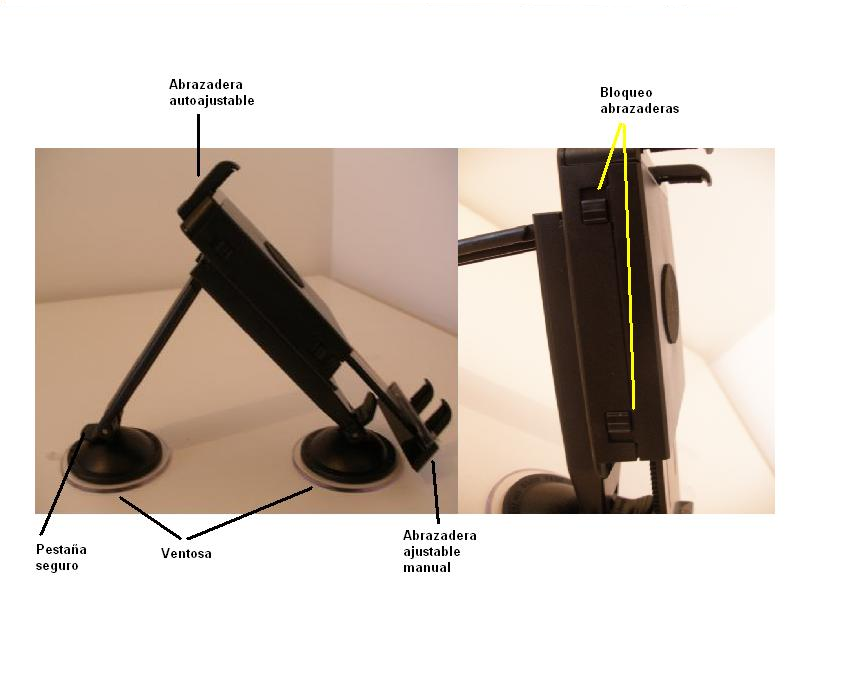

#2. Componentes del equipo
Con tu **kit Agroguía** has recibido (a)Una tableta táctil, (b)Un GPS de alta precisión, (c)Un cable de alimentación con adaptador para mechero y (d)Un soporte para la tableta.
##2.1. Tablet PC + alimentador

##2.2. GPS externo + alimentador

##2.3. Soporte
