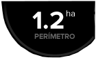

###4.1.1. Etiquetas

* **Velocidad**: en todo momento vamos a tener un indicador en la parte inferior derecha de la pantalla, donde aparece la velocidad en km/h.
* **Área recorrida o tratada**: justo al lado de la velocidad, existe otro indicador que informa del área tratada que se lleva hasta ese momento. Este dato nos informa del área que ya se ha tratado, teniendo en cuenta que si por ejemplo se ha dejado una falta, esa porción no la contará y si se ha remontado alguna zona, la contará dos veces.
* **Área perimetral**: esta etiqueta informa del área total en hectáreas que tiene la parcela que se ha medido. El proceso de medida de una parcela se explica en el punto siguiente.
