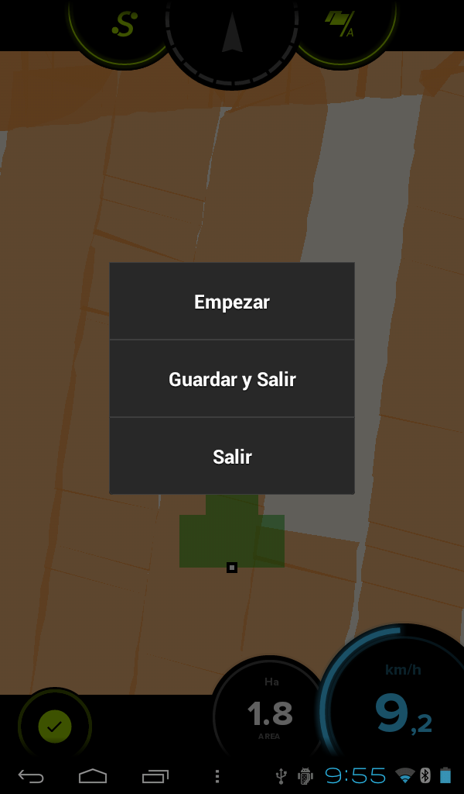

###4.1.2. Botones

* **Pausa**: Sirve para detener el trabajo temporalmente. Se activa o desactiva pulsando en la zona centro de la pantalla. El vehículo se puede desplazar pero sin que marque zona tratada. Un ejemplo de uso es cuando se disponde del remolque a pié de tierra con mineral y se acaba la carga de la cuba. Entonces se pulsa la pausa y se puede ir a cargar pero sin que marque. Así se puede regresar donde se había acabado el tratamiento y una vez situado, quitar la pausa para seguir tratando.
* **A/B**: estos botones son para el modo de trabajo AB que será explicado en el punto 4.1.3.

* **Salir**: Este botón da 3 opciones. 

	1. *Empezar de nuevo*: con esta opción se borra lo tratado hasta ahora y se comienza de cero.
	2. *Guardar y salir*: permite almacenar el trabajo realizado, tanto si se ha finalizado el tratamiento como si no y posteriormente se va a volver a seguir con dicho trabajo.
	3. *Salir sin guardar*: se sale a la pantalla principal de **Agroguia** sin guardar.

* **Área perimetral**: Permite calcular el área de la parcela dando una vuelta alrededor de la misma. El procedimiento es pulsar el botón al comenzar a dar la vuelta y volver a pulsar el mismo botón, una vez hayamos terminado. Entonces aparecerán las hectáreas totales de la parcela.

  **NOTA IMPORTANTE**: No es necesario que el tractor vaya por el borde de la parcela, lo que tiene que ir al borde es el apero que enganchado y cuya anchura se ha introducido al arrancar el programa. **Agroguía**, internamente, ya tiene en cuenta la distancia del GPS al extremo del apero. Si por el contrario, únicamente se desea medir la parcela sin realizar ningún trabajo, se puede introducir el ancho total del tractor (de extremo exterior de una rueda a extremo exterior de la otra rueda) y dar la vuelta con la rueda al borde de la parcela.

