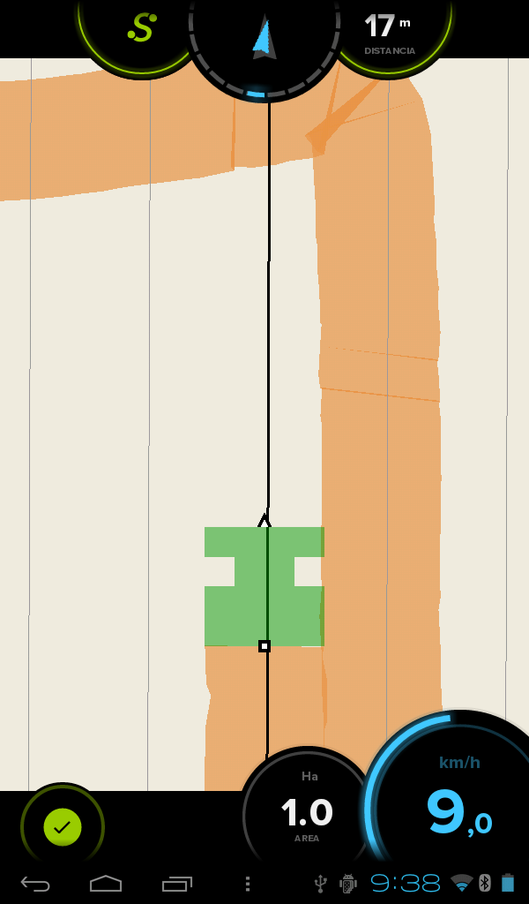

###4.1.3. Modo de trabajo AB
El modo de trabajo AB permite mostrar referencias para el guiado durante el trabajo. Para usar este modo basta con trazar una línea matriz y la aplicación generará el resto de líneas paralelas a ella. El siguiente gráfico muestra donde se deberían presionar los botones.

**[1]** Punto donde se pulsa A **[2]** Punto donde se pulsa el segundo punto **[3]** Líneas rectas paralelas generadas

Al comienzo de la pasada se presiona el botón **A**. Al llegar al final de esta primera pasada, se vuelve a pinchar en el mismo botón, que indicará los metros que se han recorrido desde A y la aplicación generará líneas paralelas a la primera pasada. La distancia entre líneas será la misma que la del apero utilizado y que se ha introducido al comienzo del trabajo. A continuación se incluye una imagen ejemplo:

En cada pasada hay que ajustarse a la línea correspondiente a la pasada que se quiere realizar. Es importante que la línea cruce al tractor justo por el medio. En el momento en el que el tractor se desvíe de la línea, el indicador superior o *brújula* lo reflejará indicando hacia qué lado hay que girar.  
Una de las **ventajas** que tiene el modo de trabajo A/B es que permite hacer pasadas alternas, facilitando el trabajo con aperos en los que haya que hacer muchas maniobras en el cabecero.