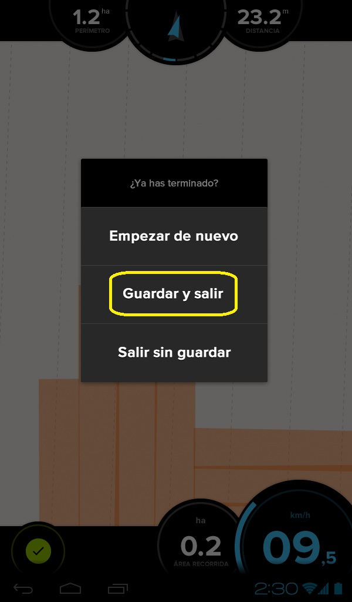
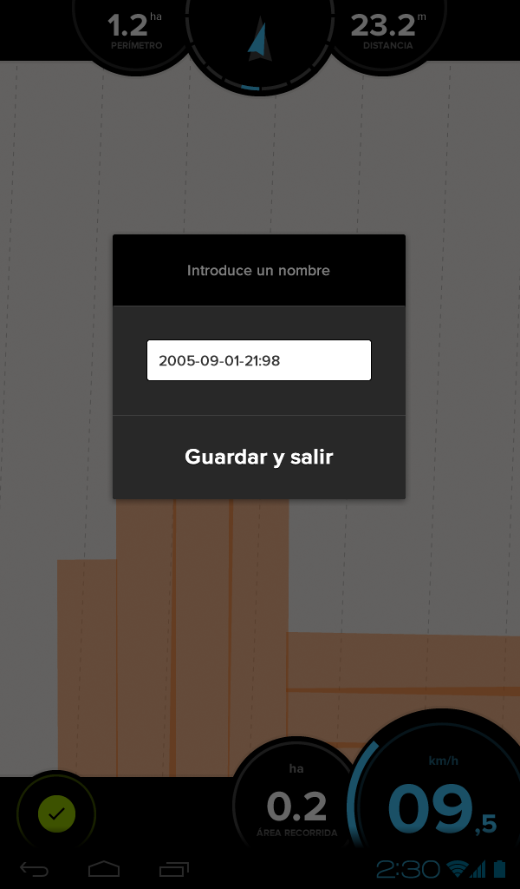
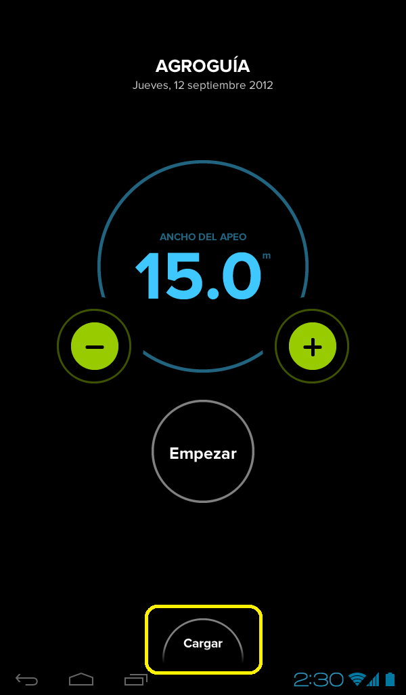
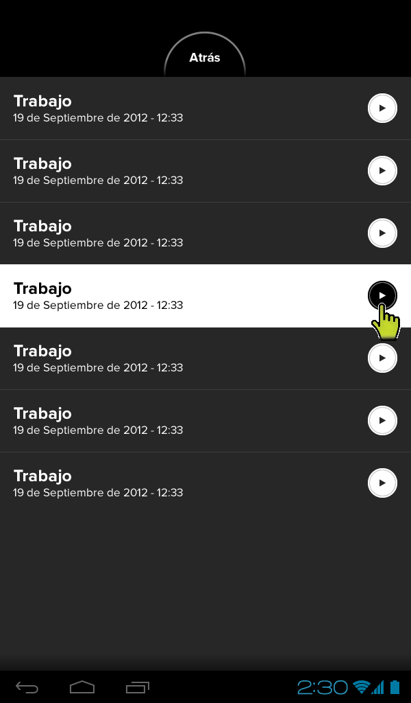
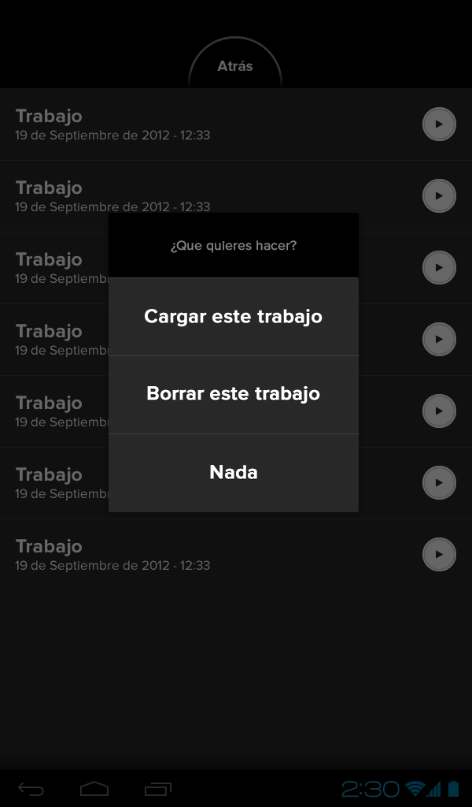

#4.2. Guardar y Cargar un trabajo
Un trabajo se puede guardar para 2 finalidades:

* Si no se ha finalizado y se quiere recuperar al volver a terminarlo. 

* Para descargarlo en el ordenador y ver el trabajo realizado sobre una foto de satélite. Ahí se podrá extraer cierta información, como fecha de comienzo y fin del trabajo, si se midió el área, zonas en las que se cometió algún error, etc.

Pasos para **guardar** un trabajo:

	1. Acceder a la opción de guardar trabajo pulsando el botón **salir**.

	

	2. A continuación aparece un menú del que habrá que elegir Guardar y Salir.

	

	3. Hay que asignar un nombre archivo. Por defecto aparecerá la fecha y hora de ese momento. 
	

	4. Finalmente pulsar en Guardar y Salir.

Para acceder al listado de trabajos guardados, simplemente hay que pulsar en la opción **Cargar** de la pantalla principal de **Agroguia**. 

Un trabajo guardado:

1. Se puede cargar para finalizarlo

2. Se puede borrar

Para acceder al menú, se pulsa encima de la flecha que aparece a la derecha del nombre del trabajo:

