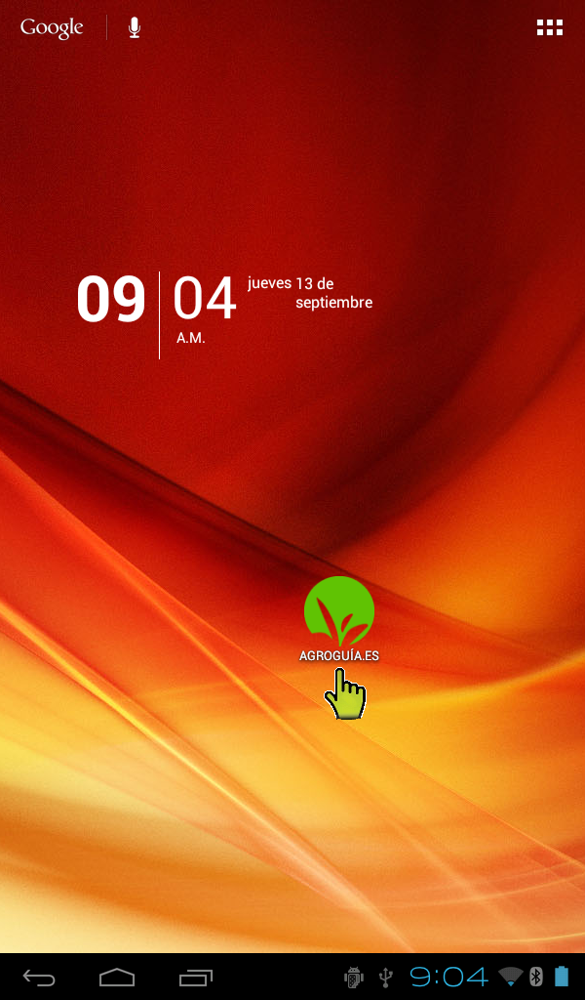
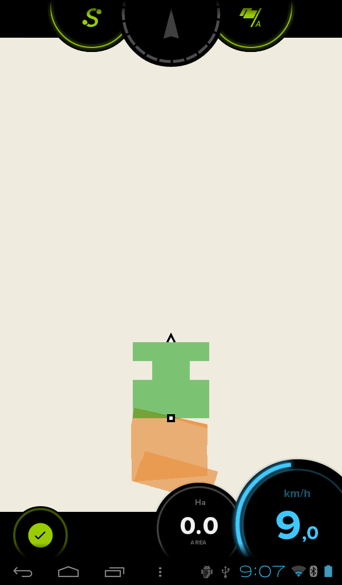

#4. Uso de la aplicación
1. El primer paso es arrancar el programa. En la pantalla principal aparecerá el icono de Agroguia sobre el que hay que pulsar.

2. Seguidamente aparece la pantalla inicial del programa, donde hay que introducir el ancho de trabajo en metros. Para ello basta utilizar los botones **+** y **-**. El ancho de trabajo debe coincidir con el ancho del apero usado o los metros de alcance del mismo.

3. Después de introducir el ancho del apero, el siguiente paso es iniciar el trabajo pulsando el botón "Empezar" y automáticamente se pasará a la pantalla de trabajo.

##4.1. Uso durante el trabajo

METER LEYENDA DE IMAGEN CON BOTONES

A continuación hay una breve explicación de cada uno de las funcionalidades y etiquetas que aparecen en la pantalla de trabajo.

###4.1.1. Etiquetas

* **Velocidad**: en todo momento vamos a tener un indicador en la parte inferior derecha de la pantalla, donde aparece la velocidad en km/h.
* **Área recorrida o tratada**: justo al lado de la velocidad, existe otro indicador que informa del área tratada que se lleva hasta ese momento. Este dato nos informa del área que ya se ha tratado, teniendo en cuenta que si por ejemplo se ha dejado una falta, esa porción no la contará y si se ha remontado alguna zona, la contará dos veces.
* **Área perimetral**: esta etiqueta informa del área total en hectáreas que tiene la parcela que se ha medido. El proceso de medida de una parcela se explica en el punto siguiente.

###4.1.2. Botones

* **Pausa**: Sirve para detener el trabajo temporalmente. Se activa o desactiva pulsando en la zona centro de la pantalla. El vehículo se puede desplazar pero sin que marque zona tratada. Un ejemplo de uso es cuando se disponde del remolque a pié de tierra con mineral y se acaba la carga de la cuba. Entonces se pulsa la pausa y se puede ir a cargar pero sin que marque. Así se puede regresar donde se había acabado el tratamiento y una vez situado, quitar la pausa para seguir tratando.
* **A/B**: estos botones son para el modo de trabajo AB que será explicado en el punto 4.1.3.

* **Salir**: Este botón da 3 opciones. 

	1. *Empezar de nuevo*: con esta opción se borra lo tratado hasta ahora y se comienza de cero.
	2. *Guardar y salir*: permite almacenar el trabajo realizado, tanto si se ha finalizado el tratamiento como si no y posteriormente se va a volver a seguir con dicho trabajo.
	3. *Salir sin guardar*: se sale a la pantalla principal de **Agroguia** sin guardar.

* **Área perimetral**: Permite calcular el área de la parcela dando una vuelta alrededor de la misma. El procedimiento es pulsar el botón al comenzar a dar la vuelta y volver a pulsar el mismo botón, una vez hayamos terminado. Entonces aparecerán las hectáreas totales de la parcela.

  **NOTA IMPORTANTE**: No es necesario que el tractor vaya por el borde de la parcela, lo que tiene que ir al borde es el apero que enganchado y cuya anchura se ha introducido al arrancar el programa. **Agroguía**, internamente, ya tiene en cuenta la distancia del GPS al extremo del apero. Si por el contrario, únicamente se desea medir la parcela sin realizar ningún trabajo, se puede introducir el ancho total del tractor (de extremo exterior de una rueda a extremo exterior de la otra rueda) y dar la vuelta con la rueda al borde de la parcela.

###4.1.3. Modo de trabajo AB
El modo de trabajo AB permite mostrar referencias para el guiado durante el trabajo. Para usar este modo basta con trazar una línea matriz y la aplicación generará el resto de líneas paralelas a ella. El siguiente gráfico muestra donde se deberían presionar los botones.

[1] Punto donde se pulsa A [2] Punto donde se pulsa B [3] Líneas rectas paralelas generadas

Al comienzo de la pasada se presiona el botón **A**. Al llegar al final de esta primera pasada, se pincha en el botón **B** y la aplicación generará líneas paralelas a la primera. La distancia entre líneas será la misma que la del apero utilizado y que se ha introducido al comienzo del trabajo. Una vez pulsado el punto B aparecerán en la pantalla las nuevas indicaciones:

En cada pasada hay que ajustarse a la línea correspondiente a la pasada que se quiere realizar. Es importante que la línea cruce al tractor justo por el medio. En el momento en el que el tractor se desvíe de la línea, el indicador superior lo reflejará indicando hacia qué lado hay que girar.  
Una de las **ventajas** que tiene el modo de trabajo A/B es que permite hacer pasadas alternas, facilitando el trabajo con aperos en los que haya que hacer muchas maniobras en el cabecero.