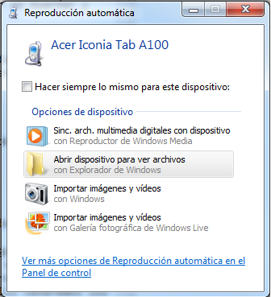
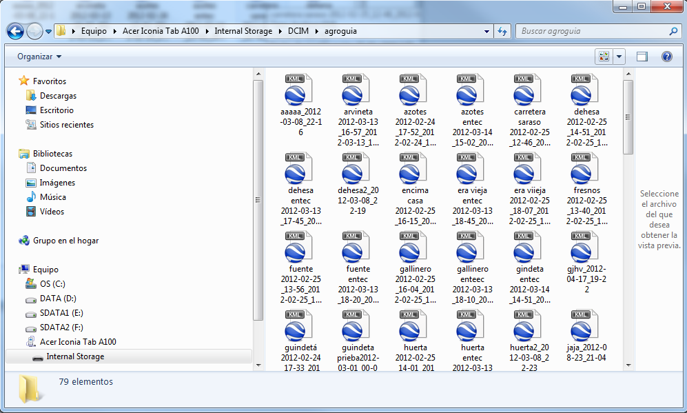
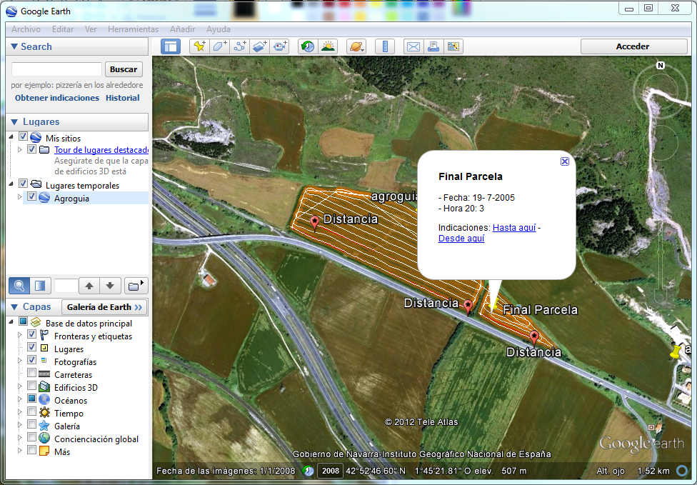

#5. Descargar trabajos al ordenador
Hay dos maneras de poder tener los trabajos guardados en el ordenador:

##5.1. A través del correo electrónico

* Hay que facilitar la cuenta de correo electrónico a una persona responsable de **Agroguia**. De esta maner, cada vez que la tablet se conecte a internet, automáticamente los trabajos son enviados al correo electrónico. 

* Para poder analizar los trabajos:
1. Se abre el correo y aparecerá un listado con trabajos enviados, junto con una dirección o enlace al que hay que acceder. 
2. Una vez allí se pueden ver la siguiente información:
	- *Nombre* que se le dio al trabajo
	- *Fecha y hora* de comienzo y fin del trabajo
	- Datos de *polígono* y *parcela* correspondiente
	- Si se midió la parcela, las *hectáreas* de la misma
	- Si se midió alguna *distancia*
	- *Área tratada*
	- *Área remontada*
	- *Tiempo* utilizado para ese trabajo, etc

##5.2. Directamente desde la tablet
Si no se dispone de cuenta de correo electrónico, la forma de poder ver los trabajos en el ordenador es a través del programa **Google Earth**, que es un programa gratuito que se puede descargar de la siguiente dirección: 

[http://www.google.es/intl/es/earth/index.html](http://www.google.es/intl/es/earth/index.html "Google Earth")

Los pasos a seguir para descargar los trabajos en el ordenador son los siguientes:

1. Conectar la tablet al ordenador mediante el cable de datos que se adjunta en la caja.
2. Acceder al sistema de archivos de la tablet como si un dispositivo de almacenamiento más se tratara.

	

3. Los trabajos se encuentran en la carpeta DCIM/Agroguia

	

	

4. Una vez dentro de la carpeta Agroguia se podrá abrir cualquiera de los trabajos haciendo doble click sobre el que se desee.

	

	Se verá algo parecido a lo siguiente, donde se podrá pinchar en las diferentes chinchetas para extraer la información:

	

	

	Aparecerán tantas chinchetas como datos se hayan recogido en el campo, es decir, si se ha medido el *área*, *distancias*, *fecha comienzo y fin* de trabajo, etc.

