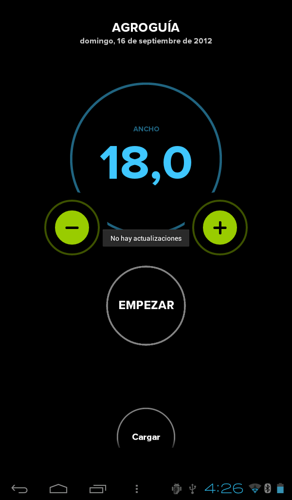
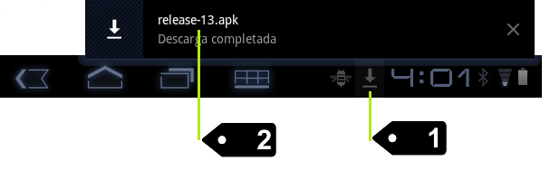

##6. Actualización del programa
Cada cierto tiempo, previo aviso a los clientes, sacaremos nuevas versiones con nuevas funcionalidades o mejoras. Los pasos a seguir para actualizar el programa **Agroguia** son los siguientes:

1. Una vez que la tablet está conectada a internet (ver manual de *Conexión de la Tablet a Internet*), con **Agroguia** arrancado, pulsar en la tecla de menú que se indica en la siguiente imagen:

2. El siguiente paso es elegir la opción **buscar actualizaciones**

3. Pueden ocurrir 2 cosas:

* Que la versión instalada en su tablet ya sea la última. En este caso se indicará en la pantalla "**no hay actualizaciones**".

* Que haya otra versión más actual que la instalada. En este caso saldrá un mensaje en la pantalla indicando que se ha iniciado la descarga “iniciando descarga”. 

4. A continuación se pulsa en (1) y para finalizar se selecciona la nueva versión (2). 

5. Finalmente hay seguir las instrucciones de instalación.

