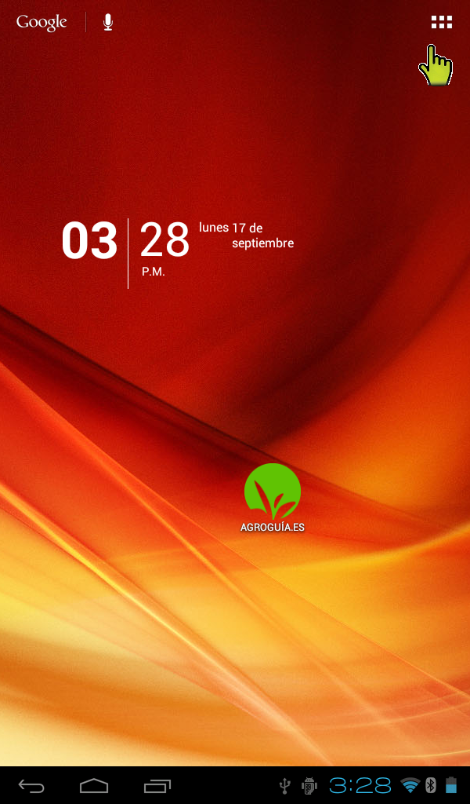
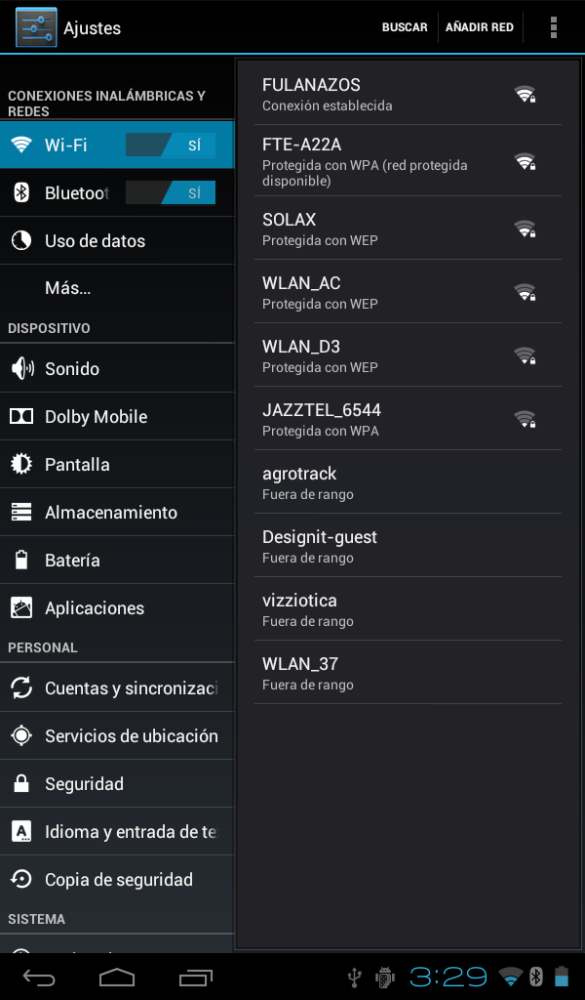
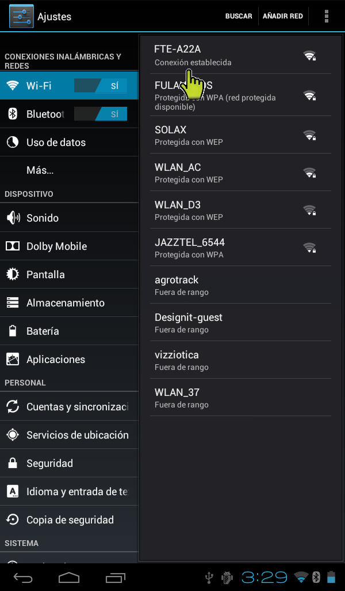

#7. Cómo conectar una tablet a internet
Para que la tablet se conecte a internet, se debe disponer de una red inalámbrica al alcance.
Para proceder a la conexión hay que seguir los pasos siguientes:

1. Acceder al menú principal con todas las aplicaciones

	

2. Entrar en Ajustes

	

3. Activar la opción Wi-Fi en el apartado Conexiones inalámbricas y elegir la Wi-Fi a la que desea conectarse

	

4. Si es una red con seguridad, habrá que introducir la clave de acceso y pulsar en Establecer conexión

	

5. Para comprobar si la conexión se ha establecido, simplemente se verifica que la tablet está conectada a la red deseada

	