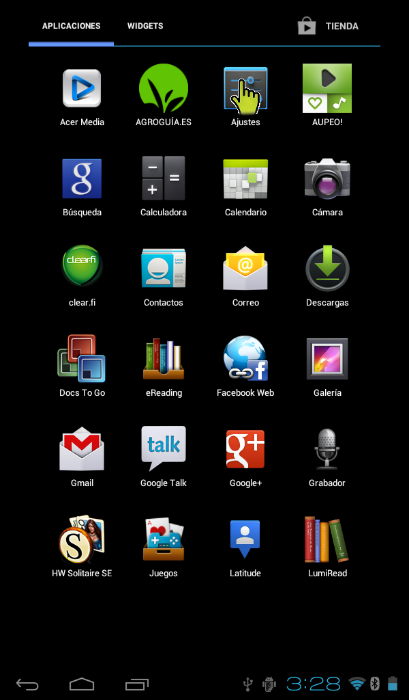

#Cómo conectar una tablet a internet
Para que la tablet se conecte a internet, debemos disponer de una red inalámbrica a nuestro alcance.
Para proceder a la conexión hay que seguir los pasos siguientes:
1. Acceder al menú principal con todas las aplicaciones

2. Entrar en Ajustes

3. Activar la opción Wi-Fi en el apartado Conexiones inalámbricas y elegir la Wi-Fi a la que nos queremos conectar

4. Si es una red con seguridad, habrá que introducir la clave de acceso y pulsar en Establecer conexión

5. Para comprobar si la conexión se ha establecido, simplemente verificamos que que estamos conectados a la red deseada
