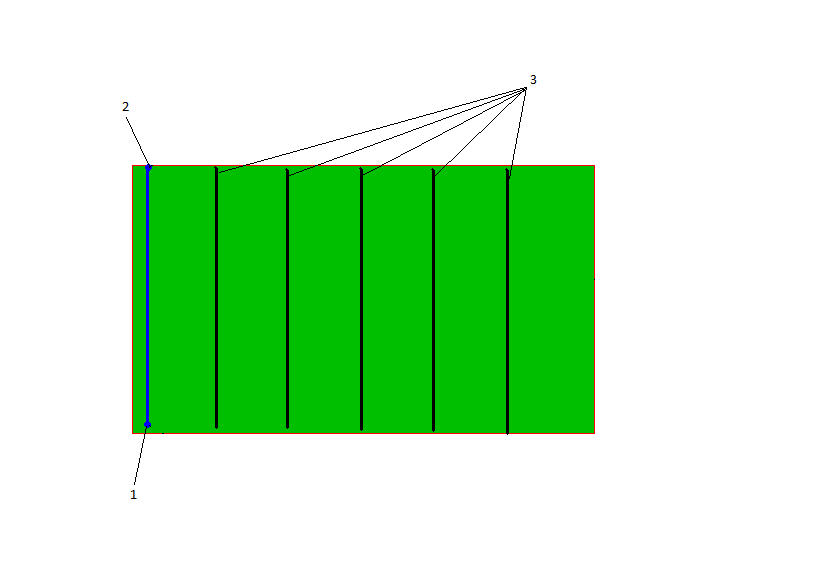
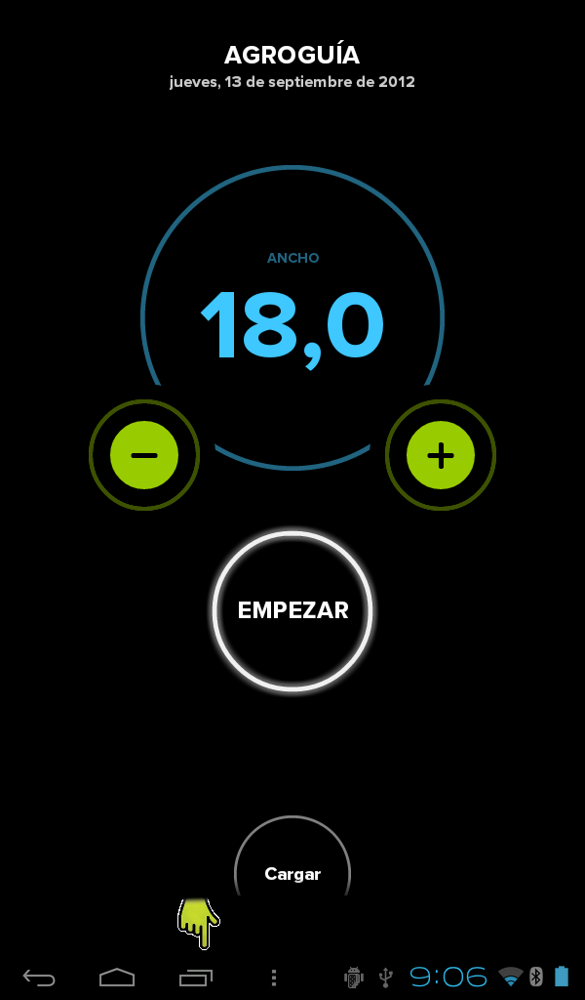
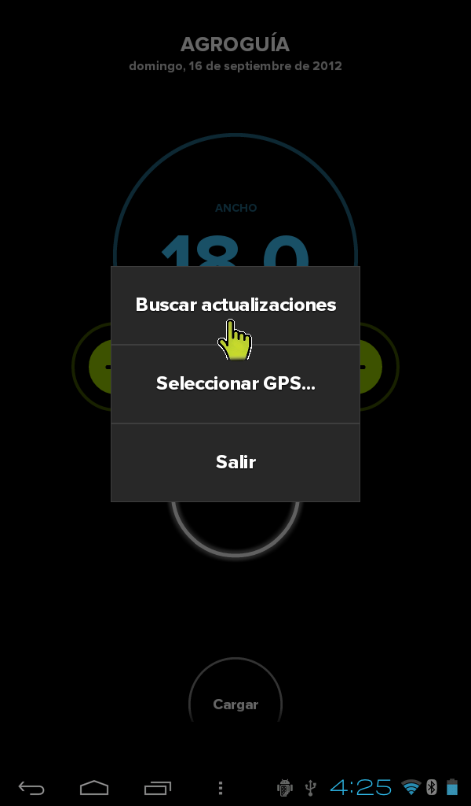
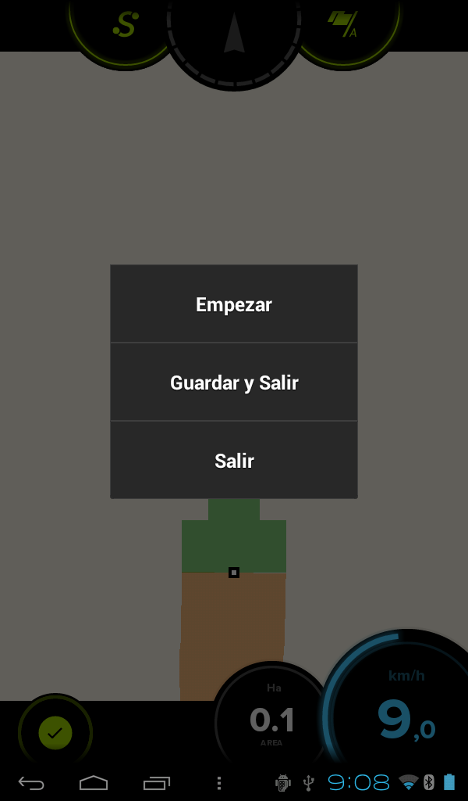
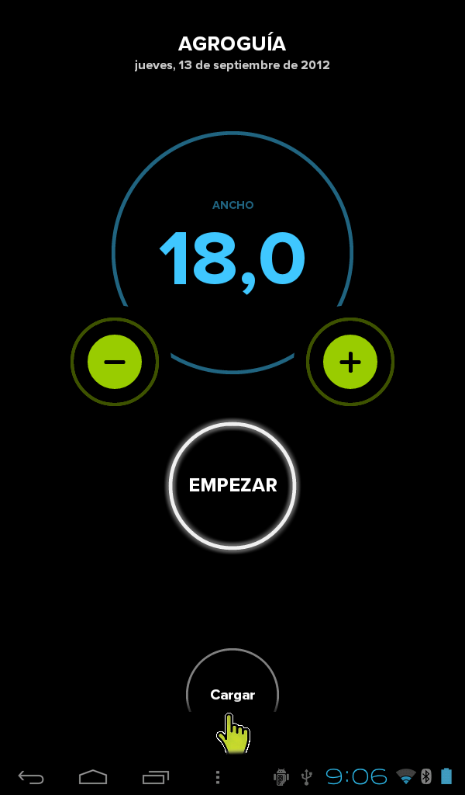
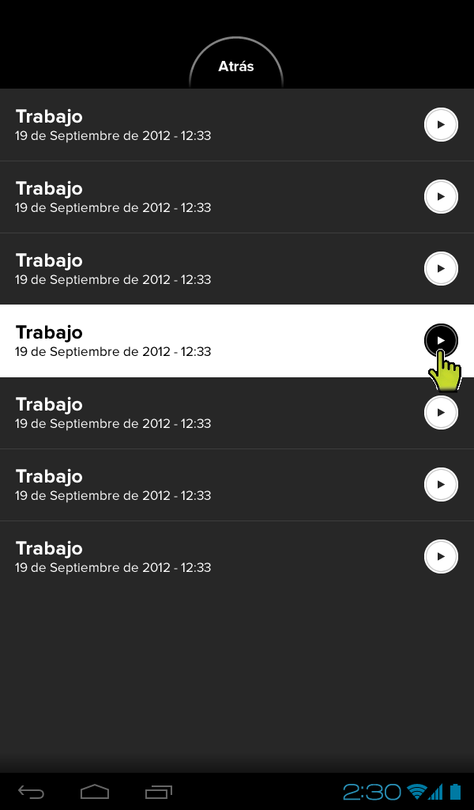
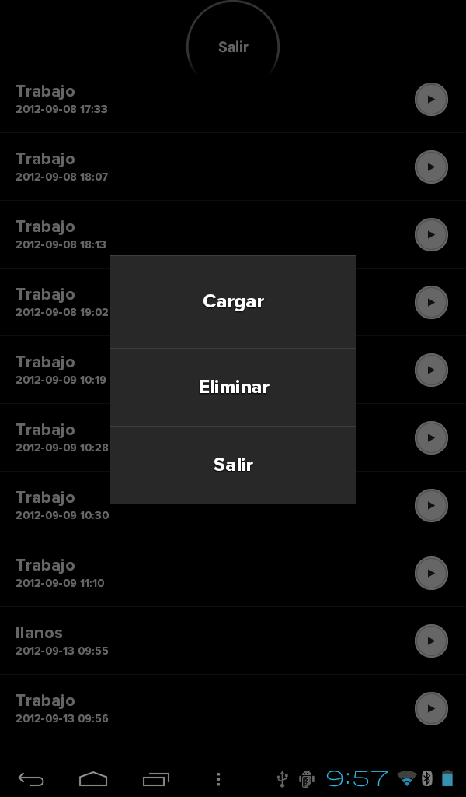

MANUAL AGROGUIA
===============

##Componentes del equipo

##Instalación
La tablet se colocará en el interior del vehículo, en un lugar visible para el agricultor sobre el soporte de doble ventosa. 
METER UNA FOTO CON EL TABLET EN EL TRACTOR
Para obtener una precisión máxima durante el trabajo, hay que tener ciertas precauciones a la hora de colocar el GPS. Debe ir centrado con respecto al ancho de la cabina. Se debe intentar que no esté cerca de aparatos de aire acondicionado o de sistemas que provoquen fuertes vibraciones, imanes, etc.  Debe ir lo más adelante posible, encima de la cabina, procurando que no tenga inclinación, es decir, nivelado respecto al suelo.

##Uso de la aplicación
El primer paso es arrancar el programa. En la pantalla principal aparecerá el icono de Agroguia sobre el que hay que pulsar.

Seguidamente tendremos la pantalla inicial del programa, donde hay que introducir el ancho de trabajo en metros. Para ello basta utilizar los botones “+” y “-“. El ancho de trabajo debe coincidir con el ancho del apero usado o los metros de alcance del mismo.

Después de introducir el ancho del apero, el siguiente paso es iniciar el trabajo pulsando el botón "Empezar" y pasaremos a la pantalla de trabajo:
METER IMAGEN CON TRACTOR
##Uso durante el trabajo
METER IMAGEN CON PANTALLA DEL TRACTOR CON ETIQUETAS PARA CADA BOTÓN
A continuación realizamos una breve explicación de cada uno de los botones y funcionalidades que tenemos mientras estamos trabajando.
*Etiquetas*
Velocidad: en todo momento vamos a tener un indicador en la parte inferior derecha de la pantalla, donde aparece la velocidad en km/h.
Área recorrida o tratada: justo al lado de la velocidad, tendremos otro indicador que nos informa del área tratada que llevamos hasta ese momento. Este dato nos informa del área que ya hemos tratado, teniendo en cuenta que si por ejemplo hemos dejado una falta, esa porción no la contará y si hemos remontado alguna zona, la contará dos veces.
*Botones*
Pausa: Sirve para detener el trabajo temporalmente. Se activa o desactiva pulsando en la zona centro de la pantalla. Sirve para seguir moviéndonos pero sin que marque como que vamos tratando. Un ejemplo de uso es cuando tenemos el remolque a pié de tierra con mineral y se acaba lo que llevamos en la cuba. Entonces se pulsa la pausa y podemos ir cargar pero sin que marque como que vamos tratando. Así podremos regresar donde nos habíamos quedado y quitar la pausa para seguir tratando.
METER IMAGEN CON PAUSA 
A/B: estos botones son para el modo de trabajo AB que será explicado a continuación.
Salir: Pulsando el siguiente botón tenemos tres opciones.  Borrar y comenzar de nuevo, salir a la pantalla principal del programa sin guardar, o guardar el trabajo y salir.

Área perimetral. Permite calcular el área de la parcela dando una vuelta alrededor de la misma. El procedimiento es pulsar el botón S al comenzar a dar la vuelta y volver a pulsar una vez hayamos terminado. Entonces nos aparecerán las hectáreas totales de la parcela. 
NOTA IMPORTANTE: No es necesario que el tractor vaya por el borde de la parcela, lo que tiene que ir al borde es el apero que llevemos enganchado y cuya anchura hemos introducido al arrancar el programa. Agroguía, internamente, ya tiene en cuenta la distancia del GPS al extremo del apero. Si por el contrario, únicamente se desea medir la parcela sin realizar ningún trabajo, se puede introducir el ancho del tractor total y dar la vuelta con la rueda al borde de la parcela.

#Modo de trabajo AB
El modo de trabajo AB permite mostrar referencias para el guiado durante el trabajo. Para usar este modo basta con marcar la primera pasada en la finca y la aplicación generará el resto de líneas que se deberán seguir. El siguiente gráfico muestra donde se deberían presionar los botones

Al comienzo de la línea se presiona el botón A. Al llegar al final de la primera pasada, se pincha en el botón B y la aplicación generará líneas paralelas a la primera. La distancia entre líneas será la misma que la del apero utilizado y que hemos introducido al comienzo del trabajo. Una vez pulsado el punto B aparecerán en la pantalla las nuevas indicaciones:

METER IMAGEN CON LINEAS Y BARRAS Y FLECHAS INDICADORAS

EXPLICAR LA IMAGEN ANTERIOR
En cada pasada hay que ajustarse a la línea correspondiente a la pasada que se quiere realizar. Es importante que la línea cruce al tractor justo por el medio.
Una de las ventajas que tiene el trazado de estas líneas es que va a permitir hacer pasadas alternas.
##Actualización del programa
Cada cierto tiempo, previo aviso a los clientes, sacaremos nuevas versiones con nuevas funcionalidades o mejoras. Los pasos a seguir para actualizar el programa Agroguia son los siguientes:
a) Una vez que la tablet está conectada a internet (ver manual de conexión de la tablet a internet), con Agroguia arrancado, pulsar en la tecla de menú que se indica en la siguiente imagen:

b) Tendremos que elegir la opción buscar actualizaciones

c) Pueden ocurrir 2 cosas
1. Que la versión instalada en su tablet ya sea la última. En este caso se indicará en la pantalla “no hay actualizaciones”.

METER IMAGEN INDICANDO QUE NO HAY ACTUALIZACIONES

2. Que haya otra versión más actual que la instalada. En este caso saldrá un mensaje en la pantalla indicando que se ha iniciado la descarga “iniciando descarga”. 

METER IMAGEN INDICANDO QUE ESTÁ DESCARGANDO

A continuación se pulsa en (1) y para finalizar seleccionamos la nueva versión (2). Finalmente seguimos las instrucciones de instalación.

METER IMAGEN CON LA FLECHITA DE DESCARGA

##Guardar y Cargar un trabajo
Todo trabajo que hemos realizado se puede guardar, independientemente de si está acabado o no. Una de la utilidades que tiene Agroguia es, que si no hemos finalizado un trabajo y no lo vamos a terminar en ese instante, se puede guardar para cuando volvamos a la parcela tener almacenado lo que se ha tratado hasta ese momento. También podemos guardar un trabajo y verlo en el ordenador sobre una foto de satélite, donde podemos extraer diferentes datos, como fecha de comienzo y fin del trabajo, si se midió el área, zonas en las que se cometió algún error, etc.
Para guardar un trabajo debemos seguir los siguientes pasos:
a) Acceder a la opción de guardar trabajo pulsando el siguiente botón:
METER IMAGEN BOTÓN VISTO
b) A continuación tendremos el siguiente menú del que habrá que elegir la opción Guardar y Salir:

c) Tenemos que elegir un nombre para el archivo. Por defecto aparecerá la fecha y hora de ese momento. Pero podemos poner el nombre que queramos en el cajetín y finalmente pulsar en Guardar y Salir.

Si tenemos algún trabajo sin finalizar y queremos recuperarlo o queremos ver el listado de archivos guardados o borrar alguno, simplemente hay que pulsar la opción Cargar que aparece en la pantalla inicial de Agroguia.

A continuación nos saldrá un listado de todos los trabajos guardados:

Pinchamos encima del trabajo que nos interesa y pulsando en la flecha de menú, accedemos a las diferentes opciones que tenemos sobre dicho trabajo:

##Algunos detalles importantes

##Descargar trabajo en el ordenador
Para poder tener los trabajos realizado en el ordenador se pueden seguir dos procedimientos:
###1. A través del correo electrónico
Debemos facilitar la cuenta de correo electrónico a una persona responsable de Agroguia. Esto sirve para que cada vez que la tablet se conecte a internet, automáticamente los trabajos son enviados al correo. Para poder analizar los trabajos, debemos abrir el correo en el que aparecerá un listado de los trabajos enviados junto con una dirección o enlace al que debemos ir. Una vez allí tendremos los trabajos guardados durante la labor y en el que aparecerán diferentes datos como son:
- Nombre que se le dio al trabajo
- Fecha y hora de comienzo y fin del trabajo
- Datos de polígono y parcela correspondiente
- Si se midió la parcela, las hectáreas de la misma
- Si se midió alguna distancia
- Área tratada
- Área remontada
- Tiempo utilizado para ese trabajo, etc

###2. Directamente desde la tablet
Si no disponemos de cuenta de correo electrónico, la forma de poder ver los trabajos en el ordenador es a través del programa Google Earth. Es un programa gratuito que se puede descargar de la siguiente dirección: http://www.google.es/intl/es/earth/index.html
El procedimiento que hay que seguir para descargar los trabajos en el ordenador es el siguiente:
1. Conectar la tablet al ordenador mediante el cable de datos que se adjunta en la caja.
2. Acceder al sistema de archivos de la tablet como si un dispositivo de almacenamiento más se tratara.

3. Los trabajos se encuentran en la carpeta DCIM/Agroguia

4. Una vez dentro de la carpeta Agroguia podremos abrir cualquiera de los trabajos haciendo doble click sobre el que deseemos.

Podremos ver algo parecido a lo siguiente, donde podremos pinchar en las diferentes chinchetas para extraer la información:

Nos aparecerán tantas chinchetas como datos hayamos recogido en el campo, es decir, si hemos medido áreas, distancias, fecha comienzo y fin de trabajo, etc.

